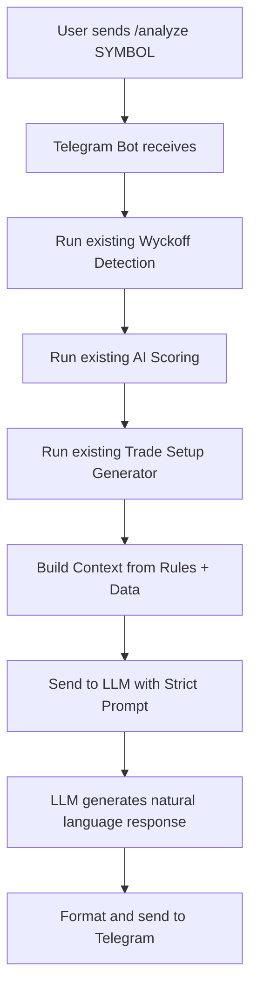

# LLM Integration Plan for Stealth Accumulation Scanner

## Objective
Enhance the Telegram bot's stock analysis response using LLM/AI while preserving ALL existing Wyckoff rules, scoring weights, and trade setup generation logic.

---

## Section 1: Existing Requirements (MUST NOT DEVIATE)

### 1.1 Wyckoff Accumulation Detection Rules

| Factor | Rule | Threshold |
|--------|------|-----------|
| **Price Structure** | 30-90 day sideways range | Range % < 25% |
| **Support Strength** | 3+ touches of support | Within 3% deviation |
| **Volatility** | ATR declining over 10-20 sessions | ATR trend = 'declining' |
| **Volume Pattern** | Up day volume > Down day volume | up_volume_ratio > 1 |
| **Delivery Data** | Delivery % increasing | Current >= 50% |
| **Relative Strength** | Outperforming Nifty 50 | RS ratio > 1 |
| **MA Behavior** | Price above flattening 50 DMA | MA trend = 'up' or 'flat' |
| **Breakout** | Within 5% of resistance | near_breakout = true |

**Final Determination**: At least 3 of 4 core factors must be positive:
- price_structure
- support_strength
- volume_pattern
- ma_behavior

### 1.2 AI Scoring Model Weights

| Factor | Weight | Max Score |
|--------|--------|-----------|
| Price Structure | 20% | 20 |
| Volume Behavior | 20% | 20 |
| Delivery Data | 15% | 15 |
| Support Strength | 15% | 15 |
| Relative Strength | 10% | 10 |
| Volatility Compression | 10% | 10 |
| MA Behavior | 10% | 10 |

**Classification**:
- 80+ → Strong Accumulation → Buy
- 60-79 → Moderate Setup → Watch
- <60 → Weak Setup → Skip

### 1.3 Trade Setup Generation Rules

**Entry**:
- Breakout: Resistance × (1 + 2%) = 102% of resistance
- Early Accumulation: Resistance × (1 - 3%) = 97% of resistance

**Stop Loss**:
- Below support × (1 - 2%) = 98% of support
- Max loss: 3%

**Targets**:
- T1: Entry + (Range Height × 1.0)
- T2: Entry + (Range Height × 1.5)
- T3: Previous resistance level

**Risk/Reward Calculation**:
- R:R = (Target - Entry) / (Entry - Stop Loss)

**Duration**:
- Short term: 2-4 weeks (near breakout)
- Medium term: 1-3 months (early accumulation)

---

## Section 2: LLM Integration Architecture

### 2.1 System Flow Diagram



### 2.2 Prompt Engineering Strategy

**System Prompt** (strict constraints):
```
You are a professional stock analyst specializing in Wyckoff methodology.
You MUST follow these exact rules for all analysis:

SCORING RULES:
- Price Structure: 20% weight, Score 0-20
- Volume Behavior: 20% weight, Score 0-20
- Delivery Data: 15% weight, Score 0-15
- Support Strength: 15% weight, Score 0-15
- Relative Strength: 10% weight, Score 0-10
- Volatility Compression: 10% weight, Score 0-10
- MA Behavior: 10% weight, Score 0-10

CLASSIFICATION:
- Score 80+: STRONG ACCUMULATION → Recommendation: BUY
- Score 60-79: MODERATE SETUP → Recommendation: WATCH
- Score <60: WEAK SETUP → Recommendation: SKIP

TRADE SETUP RULES:
- Entry (Breakout): Resistance × 1.02
- Entry (Early): Resistance × 0.97
- Stop Loss: Support × 0.98 (max 3% loss)
- Target 1: Entry + Range Height
- Target 2: Entry + 1.5 × Range Height
- Target 3: Previous Resistance

IMPORTANT CONSTRAINTS:
1. NEVER contradict the numerical scores provided
2. NEVER suggest different entry/stop/target values
3. ALWAYS explain WHY based on the factors provided
4. Use professional, concise language
5. Include risk warnings
```

**User Prompt Template**:
```
Analyze {symbol}

CURRENT DATA:
- Price: ₹{current_price}
- Support: ₹{support_level} ({support_touches} touches)
- Resistance: ₹{resistance_level}
- Range: ₹{range_low} - ₹{range_high} ({range_days} days)

SCORING RESULTS:
- Total Score: {total_score}/100
- Classification: {classification}
- Recommendation: {recommendation}
- Price Structure Score: {price_structure_score}/20
- Volume Behavior Score: {volume_behavior_score}/20
- Delivery Data Score: {delivery_data_score}/15
- Support Strength Score: {support_strength_score}/15
- Relative Strength Score: {relative_strength_score}/10
- Volatility Score: {volatility_compression_score}/10
- MA Score: {ma_behavior_score}/10

POSITIVE FACTORS:
{positive_factors}

NEGATIVE FACTORS:
{negative_factors}

TRADE SETUP:
- Entry: ₹{entry_price} ({entry_type})
- Stop Loss: ₹{stop_loss} (-{stop_loss_pct}%)
- Target 1: ₹{target_1} (R:R {risk_reward_1})
- Target 2: ₹{target_2} (R:R {risk_reward_2})
- Target 3: ₹{target_3} (R:R {risk_reward_3})
- Expected Duration: {expected_duration}
- Risk Level: {risk_level}

Provide:
1. Executive Summary (1-2 sentences)
2. Key Observations (bullet points)
3. Trade Rationale (why this setup)
4. Risk Factors to Watch
5. Conclusion with clear action
```

### 2.3 LLM Provider Options

| Provider | Model | Pros | Cons |
|----------|-------|------|------|
| OpenAI | GPT-4o | Best reasoning, reliable | Cost per call |
| Anthropic | Claude 3.5 | Excellent analysis | Requires API key |
| Google | Gemini Pro | Free tier available | May need tuning |
| Ollama | Llama 3 | Local, free | Requires local setup |

**Recommended**: OpenAI GPT-4o for best compliance with rules.

---

## Section 3: Implementation Steps

### Step 1: Create LLM Client Module
- Create `src/llm/llm_client.py`
- Abstract interface for different LLM providers
- Support for API key management via environment variables

### Step 2: Create Prompt Templates
- Create `src/llm/prompts.py`
- System prompt with strict rules
- User prompt template with data injection

### Step 3: Modify Telegram Bot
- Update `analyze_stock()` method
- After generating trade setup, call LLM
- Replace text response with LLM-generated response

### Step 4: Add Configuration
- Add LLM settings to `config.yaml`
- Enable/disable LLM mode
- Select provider and model

### Step 5: Error Handling
- Fallback to existing response if LLM fails
- Rate limiting for API calls
- Caching responses

---

## Section 4: Files to Modify

| File | Changes |
|------|---------|
| `src/llm/__init__.py` | New - LLM module init |
| `src/llm/llm_client.py` | New - LLM client wrapper |
| `src/llm/prompts.py` | New - Prompt templates |
| `src/notifications/telegram_bot.py` | Modify - Add LLM call |
| `config.yaml` | Add - LLM configuration |
| `.env.example` | Add - LLM API key vars |

---

## Section 5: Example LLM Response

**Input**: /analyze RELIANCE

**LLM Output**:
> ## 📊 RELIANCE - Analysis Report
>
> **Recommendation: 🟢 BUY - Strong Accumulation (Score: 82/100)**
>
> ### Executive Summary
> RELIANCE shows strong institutional accumulation with a well-defined trading range over 65 days. The stock is positioned near breakout with favorable risk-reward.
>
> ### Key Observations
> - ✅ Strong consolidation with tight range (18.5% over 65 days)
> - ✅ Volume accumulation evident (up/down ratio: 1.4)
> - ✅ Rising delivery percentage (52% current)
> - ✅ Strong support at ₹2,850 (4 touches)
> - ✅ Price above flattening 50 DMA
> - ⚠️ Near breakout - await confirmation
>
> ### Trade Rationale
> The Wyckoff analysis reveals Phase A accumulation with:
> 1. Multiple support tests indicating institutional buying
> 2. Declining ATR suggesting volatility compression
> 3. Strong relative strength vs Nifty (+12%)
>
> Entry at ₹2,965 offers 2.8R reward with tight stop at ₹2,790.
>
> ### Risk Factors
> - Breakout failure possible - respect stop loss
> - Monitor volume on breakout day
> - Watch for news/events that may impact sentiment
>
> **Note**: This is technical analysis only. Always use proper position sizing.

---

## Section 6: Backward Compatibility

- LLM mode can be toggled on/off
- If LLM fails or is disabled, falls back to existing formatted response
- All existing rules remain unchanged - LLM only adds natural language explanation
- No changes to detection, scoring, or trade generation logic

---

## Summary

This plan adds LLM-powered natural language responses while:
1. ✅ Preserving ALL Wyckoff detection rules
2. ✅ Preserving ALL scoring weights and thresholds
3. ✅ Preserving ALL trade setup generation formulas
4. ✅ Adding AI explanations that respect the numerical data
5. ✅ Maintaining backward compatibility
